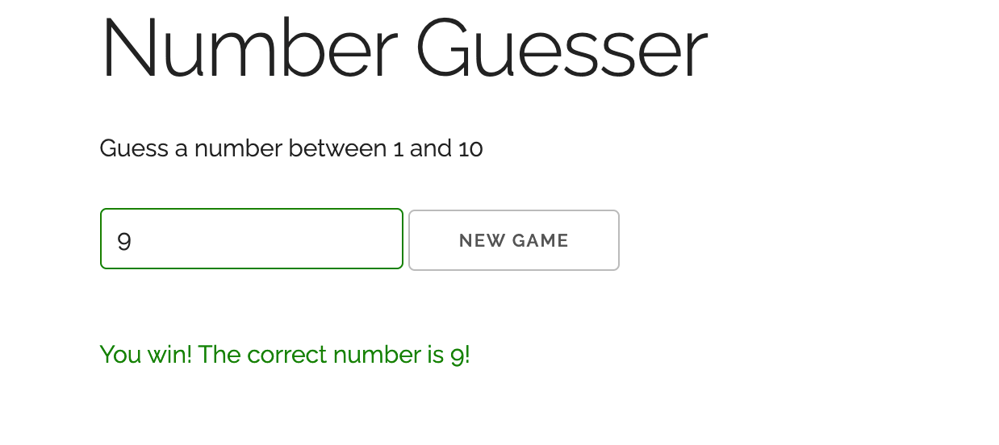

# _Number Guesser_

#### This project is a browser-based number guesser application that replicates the classic game, "I'm thinking of a number between 1 and 10. Which is it?"

#### _06/2021_

#### By _**Chris Korsak**_

## Description

This number guesser application is a project from [Modern Javascript From The Beginning](https://www.udemy.com/course/modern-javascript-from-the-beginning) on Udemy. It incorporates javascript DOM manipulation to support the game logic in a simple and clear manner.

Additionally, this application uses a CSS boilerplate framework called [Skeleton](http://getskeleton.com/) to create the user interface. This application is fully responsive to all screen sizes.

## Game Logic

* Player must guess a number between a min and max number
* Player gets a certain amount of guesses
* Notify player of guesses remaining
* Notify player of the correct answer if they lose
* Notify player if they choose a number outside of the range.
* Let player choose to play again

## Setup/Installation Requirements

None. This is a web-based application hosted on Github pages. Check out the app [here!](https://chriskorsak.github.io/number-guesser/)

## Technologies Used

* HTML
* CSS (Skeleton framework)
* Javascript